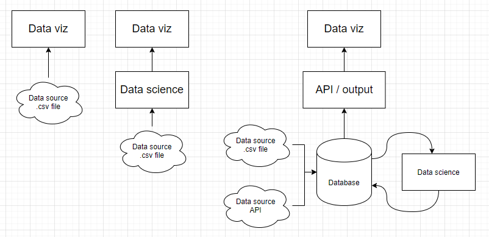
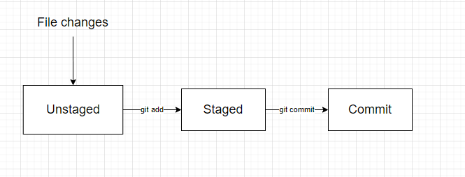

# Broad topics for this module

- **Data wrangling** - parsing, filtering, combining, sorting, fixing, data types, working with text
- **Data pipelines** - reading, processing, storing, automation, hosting
- **Databases** - different types, advantages/disadvantages, select the right database, schemas, interacting with database
- **SQL**
- **APIs** - how to use APIs, how they are built
- **Hosting and architecture**
- **Web scraping** - HTML, text parsing
- **Fundamentals**
  - Programming in Python
  - Basic shell usage
  - Version control in Git
  - GitHub for collaboration
- How to approach Python tasks and learn new libraries

# Foundation knowledge

- Basic Python skills
  - Variables
  - Functions
  - Data types
    - int, floats, strings, lists, tuples, dictionaries
  - Iteration
    - for loops, while loops, iterators
  - Conditionals
    - if, else, elif
  - boolean expressions (and, or, ==)
  - importing modules
  - installing and using third party libraries

# Overview of how the three modules fit together

Here are three simplified, functional overviews of how data flow might look, from source to screen, in a dataviz project:
# 

# Today

- Short poll
- Git & GitHub
- Approaching Python tasks
- Data types & CSV
- Reading CSV in Python

# Git

# What is Git and why is it useful?

- Distributed version control system
- View history
  - Can see the history of every line of code
  - Accountability
- Revert changes
  - Remove newly introduced bug
- Branching and merging
  - Allows people to work in parallel
  - Fast workflow for merging work together
- Enables large-scale collaboration

# What is GitHub?

- Web service and servers for Git projects
- The largest the open source hub
- Free for open source projects
- Provide lots of tools for collaboration
  - Code browser & search
  - Issue tracker
  - Pull requests
  - Wikis
  - Profiles

# Git file tracking

This is an overview of how git tracks changes to your files. They start as unstaged changes, then you `git add` them to the staging area, and then you `git commit` everything in the staging area, which adds those changes to the repo and means they are now tracked.

# Approaching new tasks in Python

- Break the problem down into small chunks or steps
- It can help to write out these steps in comments
- Think about the task in terms of inputs and outputs
  - Each step can also be thought of in that way
- Experiment with interactive environments

## Resources

- Official documentation
  - API reference
  - Official guides
  - Example code & projects
- Tutorials
- Q&A websites (e.g. Stack Overflow)
- Open source projects

# Standard libraries vs third-party libraries

## Standard library

- Included with the language (no additional software required)
- Will work everywhere
- Typically better tested and more reliable
- Documentation and support can be better
- Lower level (not always a good thing)

## Third-party library

- Provide provide extra functionality
- Sometimes they provide a higher level interface
- Can be quicker in some situations
- Can be more performant

