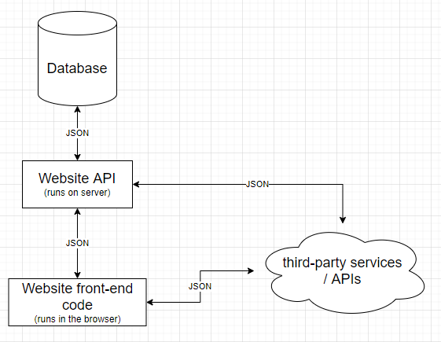

# JSON

- File format / data format
- Stores data as text
- 6 data types
  - string, numbers, arrays, objects, booleans, null
- Used everywhere
  - APIs, databases, config, pipelines, eventsystems, data viz

# JSON for communication in web systems

# JSON ubiquity

- The de facto format on the web. Come from JavaScript.
- Simple
- Easy to read
- Lightweight
- Flexible
- Well supported

# APIs

- *Application Programming Interface*
- The *interface* or *connection layer* between two bits of software
- Exposes functionality for developers to use

# Web APIs
- Allows you to interact programmatically with software over the web
- Runs on web technologies (e.g. HTTP)
- Commonly for:
  - Interacting with web platforms (e.g. Twitter)
  - Accessing data (e.g. Goverment APIs)
